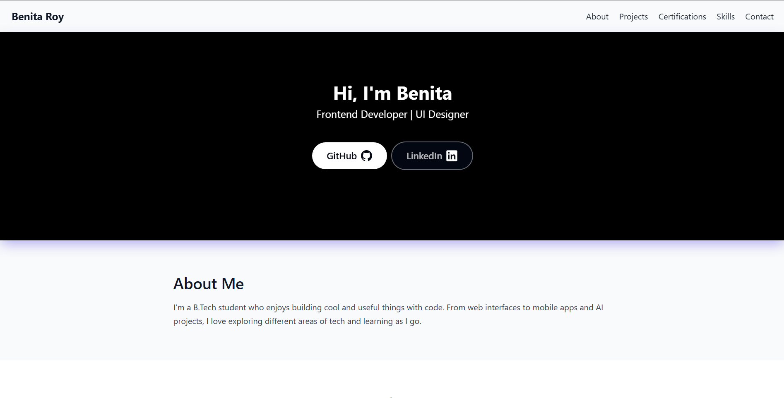

# Portfolio-Website

Welcome to my personal developer portfolio — a space to showcase my technical journey, projects, skills, and credentials. This site is built with accessibility, responsiveness, and visual clarity in mind using **Tailwind CSS** and modern frontend practices.

---

## 🚀 About This Project

This portfolio highlights:

- 🎯 My focus areas: **Speech Processing**, **Frontend Development**, and **Applied Machine Learning**
- 🛠️ Projects ranging from mobile apps to real-time speech sentiment analyzers
- 🧠 Certifications and skills in modern web tools
- 🎮 Game development and 3D modeling demos using Godot and Blender

---

## 🧰 Tech Stack used for this project

- **Languages**: HTML, CSS, JavaScript (currently all included in the index.html file)
- **Frameworks**: Tailwind CSS
- **Design Tools**: Figma

---

